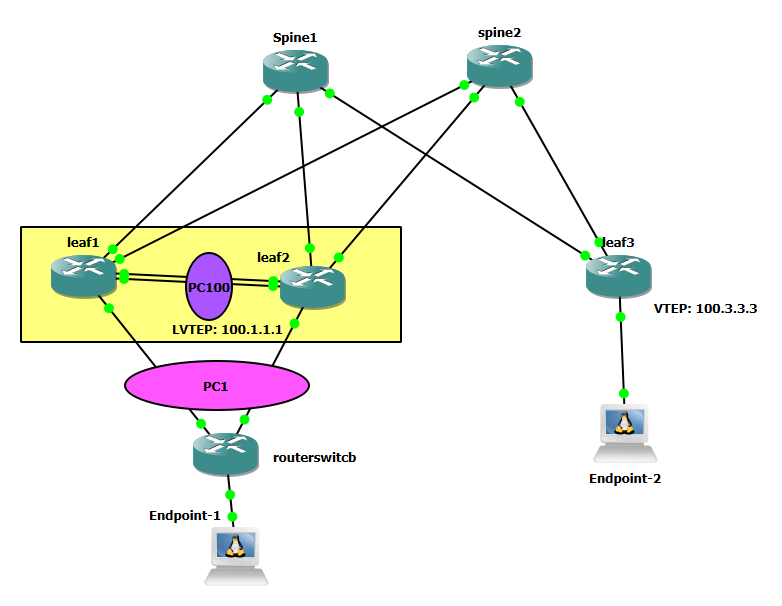

# Networking Automation using Claude AI, MCP Server, and VXlAN CLOS topology with SONiC

Automate network management for spine-and-leaf topologies running SONiC with lvtep VXLAN EVPN configuration. This project leverages Claude AI and the Model Context Protocol (MCP) to provide intelligent, conversational network automation through GNS3.

## 🚀 Overview

This project combines **GNS3** with **Broadcom SONiC routers with  lvtep mclag configuration**, **Claude AI**, and the **Model Context Protocol (MCP)** to deliver intelligent network automation. Query your network topology, execute show commands, and push configurations through natural language—all powered by Claude.

### Key Features

- **AI-Powered Automation**: Use Claude AI to intelligently query and manage network configurations
- **MCP Server Integration**: Seamless integration with Claude through MCP for real-time network operations
- **Spine-Leaf Topology**: Pre-configured multi-router architecture with automated management
- **OSPF Underlay Configuration**: OSPF-based routing for scalable network design
- **BGP VXLAN EVPN Overlay**: Automated overlay networking with Layer 2 and Layer 3 VNI support
- **LVTEP MCLAG**: Leaf 1 and leaf 2 having the same VTEP ip address
- **SSH-Based Device Management**: Direct connectivity to all network devices via Netmiko
- **Alpine Linux Endpoints**: Multi-VLAN support with lightweight server endpoints

## 📋 Prerequisites

- **GNS3** with Broadcom SONiC router images
- **Python 3.8** or higher
- **Claude API** access with MCP Server capability
- **Broadcom SONiC router images** for GNS3 deployment
- **SSH access** configured for network devices
- **Alpine Linux images** for endpoint deployment in GNS3

## ⚒️ Project Tech Stack

- Claude AI (via Code Interpreter)
- MCP Server (FastMCP)
- GNS3 (Network Simulator)
- Python 3.x
- Netmiko (Network Device Connection)
- Broadcom SONiC OS
- Alpine Linux
- VS Code

## 🚀 Getting Started

1. **Deploy GNS3 topology** with SONiC images
2. **Create inventory** JSON file with your router details
3. **Configure SONiC devices** with VXLAN EVPN and BGP
4. **Set up MCP server** with the provided Python script
5. **Register with Claude** using the MCP add command
6. **Start automating** via natural language queries!
## 🛠️ Project Steps

### 1️⃣ Inventory Configuration

Create a JSON inventory file containing your spine and leaf routers with their respective types. The json file can be found on inventory folder

**Note:** Netmiko recognizes two SONiC types:
- **Dell SONiC**: Works identically for Broadcom SONiC; connects directly to the CLI interface
- **Edge SONiC**: Uses Community SONiC; connects to the Linux interface


### 2️⃣ Network Topology

The topology consists of:
- **1 Broadcom twoo SONiC Spine Router**
- **2 Broadcom three SONiC Leaf Routers. Leaf1 and Leaf2 are configured as LVTEP with separate**
- ** routerswitch acts a switch for portchannel between leaf1 and leaf2 for mclag configuration** 



### 3️⃣ SONiC Configuration

Configure spine and leaf routers with VXLAN EVPN and BGP underlay:
- **VLAN 10** : Layer 2 VNI (L2 overlay)
- **VLAN 999**: Layer 3 VNI (L3 overlay)
- **OSPF**: Underlay routing protocol
- **BGP VXLAN EVPN**: Overlay configuration
- **LVTEP Mclag**: leaf 2 and leaf 3 has the same vtep ip..both in active active mode with separate underlay ip address


### 4️⃣ Connect MCP Server to Claude

#### Step 1: Register the MCP Server

```bash
claude mcp add mcpmclagsonicserver  -s user -- "<mcp_server_location>" "<path_to_python_script>"
```

#### Step 2: Configure Your MCP Python Script

The `mcpserversonic.py` script connects Claude AI to your GNS3 topology. It includes:

- **FastMCP Integration**: For seamless MCP protocol communication
- **`run_show()` Function**: Executes show commands to query network state
- **`push_config()` Function**: Pushes configurations to devices

The script uses **Netmiko** with SSH to connect to all routers. SONiC routers have SSH enabled by default.

```python
# Example structure:
from fastmcp import FastMCP

mcp = FastMCP(""mcpmclagsonicserver"")

@mcp.tool()
async def run_show(device: str, command: str) -> str:
    """Execute show commands on network devices"""
    # Implementation using Netmiko

@mcp.tool()
async def push_config(device: str, commands: list) -> str:
    """Push configurations to network devices"""
    # Implementation using Netmiko
```

### 5️⃣ Connect the MCPServer

#### Query 1: check the overall toplogy using claude for summary of the topology

Send this command to Claude:
```
Check the status of lvtep tunnel
```


Claude logs in using the mcpserver script and network json file to give the summary of the topology

#### Query 2: Troubleshooting: removed the interface of routerswitch to leaf1 from portchannel which brought down the  line protocol. Asked Claude to fix it

Send this command to Claude:
```
Can you check the portchannel 1 between leaf1 and routerswitch
```

While troubleshooting.....you will notice that claude starts hallucinating and uses the wrong configuration. 


I suggested using the right configuration.....


Claude stopped hallucinating and used my suggested configuration to fix the problem


To stop hullucination, Intent based mcpserver with intent.json file  will be added to help claude understand how the topology should be and help with faster troubleshooting
